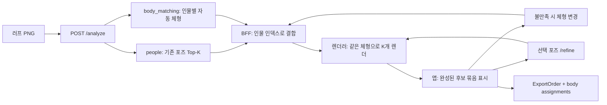

# 체형 선택 API·전체 파이프라인 연동 계약 v1

작성: 2026-10-07 · 브랜치: `codex/body-render-api` · 기준: develop `675f9bb`

## 1. 호환성 판정과 구현 상태

**기존 러프 → 인물 → 포즈 Top-K 구간에는 추가 필드 방식으로 호환된다.** 체형 하나를 자동 결정한 뒤 기존 포즈들을 그 체형으로 표시할 수 있도록 계약을 정의했다. 실제 제품의 렌더·체형 변경 저장·최종 FBX 출력까지 연결이 완료됐다는 뜻은 아니다.

| 경계 | 담당 | 현재 상태 |
|---|---|---|
| PNG → 인물·포즈 Top-K | 추론 서버 | 기존 `POST /analyze` 유지 |
| 인물별 체형 관측·자동 결정 | 추론 서버 | `body_matching` 구현·HTTP 타입 검증 |
| 체형 결정 → 렌더 주문 | BFF → 렌더러 | `POST /body/render` 구현. 선택 체형으로 converter를 호출하고 PNG 묶음 반환 |
| 체형 변경 UI·상태 저장 | BFF/앱 | 요청 DTO 제안. 이 저장소에 변경 endpoint나 영속 저장소는 없음 |
| FBX 자산 조회·리타게팅·새 썸네일 | 자산 레지스트리/렌더러 | 기존 converter `/render-thumbnail` 연결. 승인 catalog와 converter registry에 같은 FBX hash 등록 필요 |
| 포즈 미세조정 | 추론 서버 | 기존 `/refine` 유지. 반환 BVH를 다시 렌더하는 어댑터 제공 |
| 최종 포즈·체형 내보내기 | BFF/Export | 기존 ExportOrder 1.0 보존 + body-export.v1 envelope 제안 |
| 캐릭터별 체형 재사용 | BFF 2.0 | 후속 설계. 현재 person_id를 캐릭터 ID로 저장하면 안 됨 |

현재 배포용 `config/body_catalog.v1.json`은 빈 목록이다. 평가에 사용한 9종은 `evaluation_only`이며 평가 결과만으로 운영 QA 승인을 부여하지 않는다. 체형 기능 기본값은 off이고 배포 설정은 바꾸지 않았다.



## 2. 현재 HTTP: `POST /analyze`

요청은 그대로 `multipart/form-data`: PNG `file`, 기존 선택적 `hint`, `rescue`. 체형 선택용 사용자 사전 입력을 추가하지 않는다. 서비스의 `BODY_MATCHING_MODE=off|shadow|auto`로 기능을 제어한다.

Python에서 API 함수를 직접 호출하는 내부 코드는 `out.body_matching.people` 또는 `out.model_dump()["body_matching"]`으로 접근한다. wire의 JSON object 형식은 유지되지만 Pydantic 필드의 Python 타입은 dict에서 모델로 변경됐다. 코어 `CutResult.body_matching`은 계속 dict다.

기존 `people[].candidates`, 좌표, 카메라, 거리, refine 정책 필드는 그대로다. 사람 수와 포즈 순위를 체형이 바꾸지 않는다. Top-5는 기존 기본 설정이며 후보가 적으면 실제 K개만 반환한다.

### 추가 필드

| 필드 | 의미 / 소비 규칙 |
|---|---|
| `body_matching` | off/기존 경로에서는 정확히 `{}` |
| `schema_version` | `body-match.v1`: wire 형식 버전 |
| `mode` | auto 또는 shadow |
| `status` | ok / partial / unavailable / not_applicable |
| `input_sha256` | PIL RGB 이미지 크기 문자열 + 픽셀 bytes의 hash. 업로드 PNG 파일 bytes의 hash와 다를 수 있음 |
| `catalog_version`, `catalog_sha256` | 선택 당시 카탈로그 snapshot |
| `people[].person_index` | 같은 응답의 `people[].index`와 결합 |
| `people[].person_id` | `<input_sha256>:p<person_index>`; 현재 분석 안의 식별자 |
| `auto_body_id` | 자동으로 고른 체형 |
| `applied_body_id` | auto에서는 같은 ID, shadow에서는 null. 렌더에 요청할 선택이며 이미 그려졌다는 의미가 아님 |
| `selected_asset` | body_id, body_version, asset_sha256, rig_version, measurement_version |
| `pose_bindings` | 기존 후보와 동일한 순서의 pose_id, 정확한 view, pose_sha256(nullable) |
| `selection_source` | auto_best_effort / auto_default / auto_visual_best_effort. 모두 미보정이며 확률이 아님 |
| `diagnostic`, `reason_codes` | 부족한 단서·자산 없음·provider 실패 등의 원인 |
| `observations` | 가시성·형태·캐릭터 디자인 표현·근거 |
| `presentation_selection` | 디자인 단서에 따른 후보 계열 제한/동점·기본값 사용 내역 |
| `render_required` | 외부 렌더 주문이 필요하다는 신호 |
| `rendering_executed` | `/analyze`에서는 항상 false. 렌더는 별도 `/body/render` 호출 |

`acceptance_probability=null`이며 `rank_score`도 이미지 비교 결과에서는 null일 수 있다. UI는 이를 확률 또는 일치율로 표시하지 않는다. `auto_default`는 기본값을 골랐다는 뜻이므로 체형을 알아냈다고 표현하지 않는다.

### 형태 속성 값

`observations.attributes`의 각 값은 `{value, visibility, evidence}`다. unknown은 null이며 숫자 0은 실제 관측값이다.

| 축 | 허용값 |
|---|---|
| head_ratio_class | h3/h4/h5/h6/h7/h8 |
| body_build | small_frame/slim/regular/athletic/muscular/chubby/large_frame |
| frame_width | narrow/regular/broad |
| limb_proportion | short/regular/long |
| muscularity_visual, soft_volume | 정수 0..4 |
| volume_distribution | even/abdomen/lower_body |

`coverage`는 head/torso/arms/legs 각각 visible/uncertain/unknown이다. `full_body_visible`은 전신 관측 여부이며, 잘림/단축 시 등신은 unknown으로 제외한다. 정밀 cm·kg 또는 실제 나이를 반환하지 않는다.

### 캐릭터 남성형·여성형 디자인 관측

`observations.presentation.value = feminine | masculine | androgynous | null`, visibility는 visible/uncertain/unknown이다. 실제 인물의 생물학적 성별 필드가 아니다. 체격·근육량과 분리된 캐릭터 디자인 단서다.

- 명확한 단서: 적격 자산 중 같은 계열 또는 unisex를 비교.
- 헤어·의상만의 약한 단서: 체형 점수 동점 또는 기본값에만 반영.
- 미관측: 기존 기본값을 쓸 수 있으나 `presentation_selection.mode=unresolved`.
- 캐릭터 디자인을 알아도 몸통이 가려져 있으면 `selection_source=auto_default`일 수 있다.

wire 버전(`body-match.v1`)과 관측 버전(`body-observation.v3.presentation`)은 다르다. 관측 알고리즘이 바뀌었다고 기존 포즈 응답 형식을 바꾸지 않는다. 기존 v1/v2 관측은 읽을 수 있으며 추가 관측 필드는 없거나 null일 수 있다.

### 실패 처리

| 경우 | 응답 / 앱 처리 |
|---|---|
| 기능 off | `{}`; 기존 포즈 화면 유지 |
| shadow | 자동 판단은 기록, applied=null·render_required=false; 렌더 주문 금지 |
| 얼굴/흉상 등 적용 제외 | not_applicable 또는 기존 skip 경로의 `{}`; 체형 렌더 시작 안 함 |
| 일부 자산/후보 없음 | partial, 해당 인물 unavailable |
| 카탈로그/체형 실행 오류 | unavailable; 기존 people·포즈는 계속 사용 |
| 체형 응답의 인물/포즈 순서/자산 ID 불일치 | HTTP 200 + body_matching.reason=body_contract_invalid; 기존 포즈 결과 보존 |
| 이미지 요청 자체 오류 | 기존 HTTP 413/415/422 등 유지 |

추론 실패로 기본 체형이 선택된 경우도 렌더 가능한 QA 자산이면 auto_default로 전달될 수 있다. `status=ok`는 높은 인식 정확도를 뜻하지 않는다.

## 3. 추론 결과 → BFF → 체형 Top-K 렌더

`api/body_handoff.py::build_auto_render_request()`는 **네트워크 호출 없는 순수 어댑터**다. `CutResultOut`에서 인물·체형·동일 순서의 포즈를 결합한다. 새 HTTP endpoint를 등록하지 않는다.

`BodyRenderRequest` / `body-render.v1`:

| 필드 | 규칙 |
|---|---|
| request_id | BFF가 발급한 렌더 요청 ID. 동일 payload 재시도에만 재사용 |
| analysis_input_sha256, person_id, person_index | 같은 분석/인물을 명시 |
| selection_revision | 해당 분석·인물의 현재 선택 버전. 체형 변경이나 refine 적용 시 증가 |
| selection_source | auto 또는 user_override |
| catalog_sha256 | 선택 시 카탈로그 snapshot |
| body | 선택한 단 하나의 BodyAssetRef. K개 카드가 이를 공유 |
| retarget_version, renderer_version | 주문한 변환기·렌더러 버전 |
| poses[] | candidate_index, kind(library/refined), pose_id, view, pose_sha256. library는 bvh_url, refined는 bvh 본문 |

- `candidate_index`는 0..K-1이며 기존 후보 순서를 보존한다.
- pose hash가 null이면 BFF가 기존 `bvh_url`로 bytes를 받아 hash를 확인해야 한다. 해결 전에는 어댑터가 `pose_digest_resolution_required`로 거부한다. 브라우저가 임의로 보낸 hash를 신뢰하지 않는다.
- body ID는 서버 파일 경로가 아니다. 자산 레지스트리가 정확한 body_id/version/hash를 FBX bytes로 해석해야 한다. 현재 추론 서버에 체형 FBX 다운로드 endpoint는 없다.
- 렌더러는 body hash, BVH hash, rig 지원·retarget 호환성을 재검증한다. 검색용 BVH는 계속 포즈 데이터로 사용하고 FBX는 선택한 체형 메시/리그로 사용한다.
- 기존 CandidateOut.thumbnail_url은 기존 라이브러리 이미지다. 새 체형의 미리보기로 표시하지 않는다.

권장 캐시 키: `body asset hash + pose bytes hash + view + retarget_version + renderer_version`. BFF 표시 상태는 별도로 분석/인물/selection_revision에 묶는다.

## 4. 렌더 완료·실패와 비동기 순서

아래 `BodyRenderResult`는 향후 FBX URL까지 반환할 외부 job 서비스용 제안이다. 현재 `/body/render` 응답은 §10의 `BodyPreviewResult`이며 PNG 본문만 반환한다.

`BodyRenderResult` / `body-render-result.v1`은 ready 또는 failed다. ready는 전체 후보의 preview_url, fbx_url, fbx_sha256와 원본 pose hash를 반환한다. failed는 artifacts=[]와 error_code를 반환한다. 부분 결과를 ready로 취급하지 않는다.

`render_result_matches(request, result)`가 아래 조건을 모두 확인한 경우에만 후보 묶음을 교체한다.

1. request ID, person ID, selection_revision 일치.
2. body ID/version/hash, retarget/renderer 버전 일치.
3. 후보 개수·순서·pose ID·view·source pose hash가 모두 일치.

예: 사용자가 여성형으로 변경한 뒤 예전 남성형 렌더가 늦게 와도 이를 표시하지 않는다. 새 묶음이 준비되기 전까지 이전 묶음을 표시하거나 로딩 상태를 제공하는 것은 앱 정책이다. 서로 다른 체형·revision의 카드를 섞어 표시하지 않는다.

## 5. 사용자가 체형을 바꾸는 계약

자동 체형의 Top-K를 먼저 보여준 뒤 변경 UI를 제공한다. **아래는 BFF 측 제안이며 이 추론 서버에는 아직 해당 endpoint가 없다.**

예시 라우트: `PATCH /cuts/{cut_id}/people/{person_index}/body-selection`.

본문은 `BodySelectionChange` / `body-selection.v1`:

- analysis_input_sha256, person_id, person_index
- expected_revision
- 선택한 body 참조(ID/version/hash/rig/measurement)
- scope=`current_cut_person`

BFF 처리:

1. 현재 분석/인물과 expected_revision 확인. 오래된 요청은 409, 범위/필드 오류는 422.
2. 서버 catalog에서 요청 body 참조·QA·현재 모든 pose 지원 여부 재검증. 임의 client body 정보로 승인하지 않음.
3. 상태를 원자적으로 수정하고 revision 증가. 같은 포즈 K개로 새 render request 발급.
4. VLM·포즈 검색은 다시 돌리지 않음. auto_body_id는 원래 추천으로 유지하고 사용자 applied body는 BFF 상태에 저장.
5. 새 render 결과만 원자적으로 표시.

체형 옵션 목록 제공도 BFF/자산 레지스트리 연동이 필요하다. 현재 `body_matching.candidates`는 내부 추천 Top-3이며 전체 선택 가능 라이브러리 목록이 아니다.

## 6. `/refine`과의 호환

기존 `/refine` 요청에는 기존 PersonOut의 keypoints·scores·정책 필드를 그대로 보낸다. body_matching은 refine_allowed를 바꾸지 않는다.

`apply_refine_result(batch, candidate_index, response, request_id=새_ID, resolved_pose_sha256=반환_BVH_hash)`:

- 선택 체형과 나머지 후보를 보존한다.
- 해당 후보만 교체한다. refined=true면 응답 bvh 본문을 UTF-8로 인코딩해 hash를 계산하고 bvh_url=null로 보낸다. false면 원본 bvh_url과 서버가 확인한 원본 hash를 사용한다.
- refined=true인데 bvh 본문이 없으면 오류다. `/refine.bvh_url`은 항상 원본이므로 조정본의 출처로 사용하지 않는다.
- revision 증가 및 새 request ID로 이전 렌더 결과를 무효화한다.

`/refine`의 기존 thumbnail은 선택 FBX 체형의 새 렌더가 아니다. 선택 체형으로 다시 렌더해야 한다. BFF가 사용자 변경과 refine의 동시 요청에 대해 원자적인 revision 할당을 관리해야 한다. 순수 어댑터는 영속 상태·동시성 서버를 구현하지 않는다.

## 7. `/export-order`와 최종 FBX

기존 `/export-order` 및 ExportOrder `schema_version=1.0`은 그대로 유지한다. 이 주문서에는 체형이 없으므로 **이것만 보내면 선택한 여성형·남성형 FBX 정보가 유실된다.**

BFF가 `BodyExportEnvelope` / `body-export.v1`로 묶어 Export 서비스에 넘기는 계약을 제안한다.

- pose_order: 기존 ExportOrder 1.0 원문 구조.
- analysis_input_sha256.
- body_assignments[]: person_index/person_id, selection_revision, body 참조, 최종 pose 참조.

인물마다 하나씩, 기존 주문서의 person_index/pose_id/view와 정확히 연결한다. refined pose를 골랐다면 body_assignments.pose의 refined bvh 본문/hash가 최종 pose 원본이며 기존 pose_order는 라이브러리 lineage다. library pose면 두 BVH URL도 같아야 한다. Export 서비스가 이를 구현하기 전에는 refined pose + 체형을 기존 주문서만으로 내보내면 안 된다.

CSP 축 보정·리타게팅·최종 FBX 생성은 기존 담당 경계에 남는다. 이 계약은 가동 중인 외부 Export 서비스가 이미 새 envelope를 소비한다고 보장하지 않는다.

## 8. 2.0 캐릭터별 재사용

현재 person_index는 컷 내부 인덱스이며 person_id도 같은 PNG 재분석 시 추출 순서가 바뀔 수 있다. 장기 캐릭터 키로 쓰지 않는다.

후속 BFF 계약은 project_id/character_id/profile_revision과 확정 body 참조를 저장한다. 작가가 인물을 캐릭터와 연결한 뒤에만 다음 컷에 재사용한다. 저장된 body도 현재 QA와 포즈 호환성을 재검사한다. 캐릭터 재식별·저장 endpoint·기억 기능은 이번 v1에 구현하지 않았다.

## 9. 팀 전달 파일·검증

- 실행 중 서버 OpenAPI: `/openapi.json`, `/docs`의 CutResultOut → BodyMatchingOut.
- [현재 /analyze OpenAPI snapshot](contracts/body/analyze.openapi.json)
- [체형 응답 JSON Schema](contracts/body/BodyMatchingOut.schema.json)
- [렌더 요청 JSON Schema](contracts/body/BodyRenderRequest.schema.json)
- [렌더 결과 JSON Schema](contracts/body/BodyRenderResult.schema.json)
- [수동 변경 JSON Schema](contracts/body/BodySelectionChange.schema.json)
- [Export envelope JSON Schema](contracts/body/BodyExportEnvelope.schema.json)
- [auto 응답 예제](contracts/body/analyze.auto.example.json), [shadow](contracts/body/analyze.shadow.example.json), [off](contracts/body/analyze.off.example.json), [체형 오류](contracts/body/analyze.body-error.example.json)
- [렌더 요청 예제](contracts/body/render.request.example.json), [완료 예제](contracts/body/render.ready.example.json), [변경 예제](contracts/body/selection.change.example.json), [Export 예제](contracts/body/export.envelope.example.json)

예제는 계약 테스트용 합성 fixture다. 실제 사용 가능한 FBX·러프 추론 결과나 렌더 완료 증거가 아니다.

```bash
python scripts/export_body_api_contract.py
python tests/test_body_api_contract.py
python tests/test_body_matching.py
python tests/test_body_matching_v2.py
python tests/test_body_presentation.py
python tests/test_smoke.py
```

서버 측 호환 검증과 외부 제품 E2E 검증을 구분한다. 외부 팀에서는 실제 승인 FBX 등록 → 렌더러 hash 검증 → 자동 Top-K 표시 → 사용자 변경 → 늦은 결과 폐기 → refine 재렌더 → 체형 포함 Export까지 한 컷으로 추가 검증해야 한다.


## 10. 구현된 체형 렌더 API: `POST /body/render`

`/analyze`의 자동선택 이후 BFF가 `build_auto_render_request`로 만든 `BodyRenderRequest` JSON을 보낸다. 요청당 한 인물의 1~5개 후보를 동기로 렌더한다. `/analyze`에서 Blender를 실행하지 않는다.

### 실행 설정

```bash
BODY_MATCHING_MODE=auto
BODY_CATALOG_PATH=config/body_catalog.v1.json
BODY_RENDER_CONVERTER_URL=http://converter:8001
BODY_RENDER_TIMEOUT_SECONDS=60
```

`BODY_RENDER_CONVERTER_URL` 미설정 시 503이다. 타임아웃은 후보당 초이며 0 초과 120 이하. 5개는 순차 렌더이므로 BFF의 요청 타임아웃은 전체 처리 시간을 고려해야 한다. 워커당 동시 1개 묶음이며 busy이면 503 + Retry-After: 2. 요청 취소에 따른 converter 작업 취소·지속 job 저장·렌더 캐시는 이번 범위에 없다.

승인 catalog 자산의 metadata에 `converter_character_id`를 추가한다. 예:

```json
{"metadata": {"presentation_style": "feminine", "converter_character_id": "standin-female-v2-lbs"}}
```

이 값은 예시이며 body asset과 converter registry의 FBX SHA256이 정확히 같아야 한다. 이름만 맞추거나 다른 여성 모델로 대체하면 실패한다. 카탈로그의 QA·지원 pose 목록도 필요하다. 현재 빈 운영 catalog를 자동으로 승인 목록으로 바꾸지 않는다.

### 포즈 출처

- `kind=library`: `bvh_url=/pose/{URL-encoded pose_id}/bvh`, `bvh=null`. 서버 DB로 파일을 읽고 hash 검증. 클라이언트 URL을 네트워크로 가져오지 않는다.
- `kind=refined`: `bvh_url=null`, `bvh=<RefineResponse.bvh>`. UTF-8 원문 hash 일치 필수. 본문을 strip하거나 개행을 정규화하지 않는다.
- 후보당 최대 2 MB BVH, converter가 BVH/리그 호환성을 검증한다.
- 기존 `/refine` 계약을 그대로 유지한다. 새 `/refined` 경로는 만들지 않는다.

### 반환

`BodyPreviewResult` (`body-preview.v1`): request_id, person_id, selection_revision, body, character_id, catalog_sha256, retarget_version, renderer_version, status=ready, previews[].

각 preview는 candidate_index, pose_id, view, source_pose_sha256, media_type=image/png, **data(base64 PNG)**, preview_sha256, width=256, height=256. FBX URL은 반환하지 않는다. 기존 라이브러리/고정 남성형 썸네일을 재사용하지 않고 converter가 요청된 체형으로 매번 렌더한다.

converter에는 character_id, expected_character_sha256, view, size=256, format=png와 BVH bytes를 multipart로 전달한다. 새 converter의 `X-Standin-Character-Id`, `X-Standin-Character-SHA256` 및 기존 포즈·solver·renderer·view·이미지 hash 헤더가 전부 일치해야 성공한다. 기본 기대 버전은 현재 converter의 `chain-transport-v3.2.5` / `fbx-anatomical-v1`이며 요청에 명시한다. converter를 먼저 갱신해야 한다. 구버전 converter의 헤더 누락은 502로 처리한다.

전체 후보를 사전 검증하고, 중간 렌더 실패 시 부분 성공 결과를 반환하지 않는다. 오류: 404 pose 없음, 409 catalog/asset/pose 변경·QA 미승인·미등록 체형·격리 pose, 413 BVH 크기 초과, 422 요청 형식/URL 불일치, 502 converter 오류·증거 불일치, 503 미설정·busy, 504 converter 시간 초과.

수동 체형 변경도 같은 endpoint를 쓴다. BFF가 새 body와 selection_source=user_override, 증가한 revision, 새 request_id를 전달한다. 서버가 새 body의 QA/포즈 지원을 재검증한다. 영속 상태와 동시 사용자 편집은 BFF 책임이다. 응답 반영 전 `preview_result_matches`로 **현재** 요청과 비교해야 한다. 서버는 최신 사용자 revision을 저장하지 않는다.

### 검증 근거

- 자동 5개 / 수동 교체 / refine 본문 전달 / hash·revision·오류 계약 테스트.
- 최신 develop 기반 전체 추론 테스트와 converter 계약 테스트.
- 실 남성·여성 FBX를 같은 BVH로 로컬 converter HTTP와 실제 Blender에서 각각 렌더. 이것은 렌더 연결 확인이며 메시 변형 QA나 운영 9종 승인 증거가 아니다.
