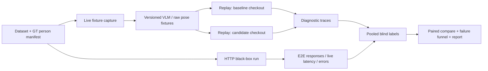

# 진단 계측 + 평가 하네스 전략 v2

> 상태: **Stage 0 부분 구현 + 운영 기준 문서**
>
> 마지막 사실·구현 확인: 2026-08-06
>
> 범위: 러프 컷 입력 → VLM 라우팅·인물 추출 → 스켈레톤 → 포즈 Top-5 → 선택 후 refine
>
> 이 문서는 기존의 “110컷” 가정과 HTTP-only 하네스 설계를 폐기하고, 저장소에서 확인된 사실과 실제 성능 평가에 필요한 계약을 다시 정의한다.

문서의 근거와 권위 순서는 다음과 같다.

1. 실행 가능한 코드·DB·파일 inventory
2. `AGENTS.md`의 현재 설계 불변식과 API 계약
3. `INFERENCE_ROADMAP.md`의 제품 우선순위
4. `엑스퍼트_피드백.md`의 평가 원칙
5. 과거 대화와 추정

1절은 저장소에서 확인한 사실이다. 2절 이후의 계약 중 구현된 범위는 1.4절과 15절 체크리스트를 단일 기준으로 삼는다. 체크되지 않은 데이터 GT·반복 VLM·라벨 UI는 아직 성능 주장에 사용할 수 없다. 숫자나 경로가 충돌하면 상위 근거를 다시 확인하고 이 문서를 갱신한다.

---

## 0. 결론

하네스를 먼저 만드는 전략은 맞다. 다만 하네스의 목적은 단순 배치 실행이 아니라 다음 질문에 재현 가능한 답을 주는 것이다.

1. 실제 타깃 인물에게 작가가 쓸 만한 후보를 제공했는가?
2. 변경 A → B가 같은 인물에서 무엇을 개선하고 무엇을 회귀시켰는가?
3. 실패 원인이 VLM, 인물 매칭, 스켈레톤, 검색·라이브러리, 외형, 정책 중 어디인가?
4. 실제 사용자 경로가 합의된 시간·오류 예산을 만족하는가?

이를 위해 다음 원칙을 고정한다.

- 평가 분모는 실행 결과가 아니라 **사전에 라벨된 GT 인물**이다.
- 제품 성능과 원인 진단을 분리한다.
- HTTP black-box 평가와 고정 입력 replay 평가를 분리한다.
- 라벨되지 않은 후보를 실패로 간주하지 않는다.
- 같은 작가·페이지에서 나온 표본을 독립 표본처럼 세지 않는다.
- refine은 `/analyze` 검색 성능과 별도 평가한다.
- 현재 12개 고유 선별 컷은 하네스 검증용이지 제품 성능 주장용이 아니다.

---

## 1. 현재 저장소에서 확인된 사실

### 1.1 평가 이미지

기존 문서의 `webtoon_rough_fullbody=81`, `webtoon_rough_verified=29`는 컷 수가 아니라 README, zip, preview, raw 파일까지 포함한 **전체 파일 수**였다.

| 위치 | 수동 선별 파일 | 비고 |
|---|---:|---|
| `data/webtoon_rough_verified/selected` | 8 | README도 “선별본 8장”으로 명시 |
| `data/webtoon_rough_fullbody/selected` | 6 | README도 “전신 검증본 6장”으로 명시 |
| 합계 | 14 | 파일 수 |
| SHA-256 중복 제거 후 | **12** | 고유 이미지 내용 수 |

확인된 완전 중복:

- `fullbody/01_chokam_two_fullbody.png` = `verified/05_chokam_everyday_left.png`
- `fullbody/02_chokam_three_fullbody.png` = `verified/06_chokam_everyday_right.png`

현재 상태:

```text
14 selected files
12 unique image contents
provenance-based scene groups: 아직 미확정
GT person 수: 아직 미확정
primary eligible near person 수: 아직 미확정
```

현재 12개 고유 이미지는 모두 **D0 Engineering**으로 둔다. calibration/holdout으로 억지 분할하지 않는다. 동일 원본의 서로 다른 crop·수정본 여부는 provenance를 확인해 별도의 `scene_group_id`로 확정한다.

### 1.2 `rough_conti`

`data/rough_conti`는 제품 성능용 gold set은 아니지만 전부 가비지도 아니다. README상 라이선스와 출처가 구분된 단일 컷 및 person candidate가 존재한다.

- 제품 품질 KPI와 작가 유용성 평가는 금지
- 파서 오류, 대량 collapse, latency, 예상 밖 입력 stress test에는 사용 가능
- `commercial_ok`, `research_only`, source별 경계를 유지
- 폴더 전체를 `_raw_discarded`로 옮기지 않는다

### 1.3 포즈 라이브러리와 역사 기준점

| 항목 | 확인 상태 |
|---|---|
| 현재 `data/poses.db` | 1,307 poses / 5,228 projections |
| DB feature version | 1 |
| baseline DB | `data/poses.baseline-20260805.db` |
| baseline DB SHA-256 | `e8453fef6d8efd51bdfd92c0d62ede5d242871ee2906b37760d1d669f5a8b62f` |
| pre-refine tag | `baseline-pre-refine` → `290337d` |
| measured tag | `measured-20260805` → `9c26d5b` |

주의:

- DB만 복사해서는 라이브러리가 완전히 동결되지 않는다. 대응하는 BVH·thumbnail 전체의 content manifest도 필요하다.
- 로컬 `data/pose-library-v1/poses.db`는 1,365 poses이고 1,307 pose baseline DB와 다르다. 검증 없이 baseline bundle로 대체하면 안 된다.
- `measured-20260805` 태그는 커밋만 가리킨다. 현재 dirty worktree를 재현하지 않는다. 공식 run은 clean worktree에서 돌리거나 dirty diff hash/source archive를 남긴다.

### 1.4 이미 있는 코드와 산출물

재사용할 것:

- `scripts/run_batch_pipeline.py`: 배치 실행과 Top-K 렌더
- `scripts/eval_search.py`, `scripts/eval_refine_batch.py`, `scripts/eval_p3_holdout.py`
- `scripts/run_skeleton_pipeline_bundle.py`의 `RecordingVLM`, `RecordingPose`
- `out/skeleton_extraction_3cut_full_pipeline_20260805/`의 `gemini_analysis.json`, `rtmpose_raw.json`
- `PersonOut`의 품질·검색 계측 필드
- `InferenceMetadataOut`의 backend/model/library/feature 정보
- `Pipeline(entries, vlm_client=..., pose_model=...)` 주입점은 `290337d`와 현재 코드 모두에 존재

2026-08-06 구현된 것:

- `standin_eval/` CLI와 versioned dataset/run/label schema
- SHA-256 이미지 중복 제거 inventory, dataset validator/seal
- deterministic GT person↔prediction Hungarian matching과 explicit miss/false-positive
- HTTP black-box run, raw response, fixed-denominator metric, failure funnel
- Recording/Replay VLM·Pose와 content-addressed cache primitives
- manifest compatibility gate, blind candidate union, paired compare
- exact/tolerance deterministic semantic comparison
- `Server-Timing` 기반 live 단계 계측과 replay 실행시간 분리
- 독립 refine-pair run, base/result BVH hash, fallback identity, post-click latency

아직 없는 것 또는 수작업이 필요한 것:

- selected12의 provenance, artist/project/scene group과 manual GT person bbox
- 신규 작가 D1/D2 데이터와 데이터 권한 기록
- VLM 반복 안정성 전용 run (`fixture capture`의 content-addressed 모델 캐시는 구현됨)
- baseline/current를 완전히 격리하는 subprocess 실행기
- family/collapse 진단, 라벨 UI, hidden repeat/double labeling
- refine 결과를 비교할 렌더러와 작가의 blind better/same/worse 라벨

---

## 2. 평가 대상과 데이터 계층

### 2.1 계층 구조

평가 데이터는 다음 계층을 보존한다.

```text
artist
  └─ project / episode / collection session
       └─ source page / scene group
            └─ cut
                 └─ GT person
```

- 집계의 기본 단위: `(dataset_version, cut_id, gt_person_id)`
- split 단위: 최소 `artist_id + project_id + scene_group_id`
- 같은 원본의 crop·resize·수정본은 같은 `scene_group_id`
- run-local `person_index`는 영구 키로 사용하지 않는다

### 2.2 데이터 tier

| Tier | 이름 | 내용 | 사용 목적 |
|---|---|---|---|
| D0 | Engineering | 합성/BVH oracle, 현재 selected12, stress corpus | 계약·결정성·러너 디버깅 |
| D1 | Calibration | 실제 타깃 작가 러프 | 라벨 루브릭·임계값·검색 튜닝 |
| D2 | Sealed holdout | D1과 다른 작가 또는 프로젝트 group | 고정 release candidate 최종 평가 |
| D3 | Prospective pilot | 실제 사용 흐름에서 앞으로 들어오는 컷 | 선택률·실제 latency·시간 절약 검증 |

D2를 열어 상세 실패를 본 순간부터 해당 셋은 D1로 강등한다. 다음 최종 검증에는 새로운 작가·프로젝트 group을 보충한다.

### 2.3 대표셋과 챌린지셋

| 셋 | 수집 방식 | 말할 수 있는 것 |
|---|---|---|
| Representative | 실제 회차·기간의 연속 컷 또는 사전 무작위 표본 | 자연 사용 분포의 제품 성능 |
| Challenge | 극단 단축·로우/하이앵글·가림·다인을 의도적으로 과표집 | 어려운 근경에 대한 엔지니어링 성능 |

Challenge micro-average를 전체 제품 성공률로 발표하지 않는다. representative 분포로 가중한 수치와 challenge slice를 별도로 보고한다.

### 2.4 target person 정의

primary denominator는 결과를 보기 전에 GT에서 고정한다.

```text
target_person :=
  eligible = true
  AND scale_class = near
  AND expected_route = core
  AND out_of_scope = false
```

`eligible`은 “이 장면에서 3D 보조를 쓰면 직접 그리는 것보다 가치가 있는가”를 입력 수집 시 작가가 사전 판단한 값이다.

다음은 분모를 바꾸지 않는다.

- 모델이 출력한 route
- 모델이 출력한 box 크기
- 출력 인물 존재 여부
- confidence 또는 abstain
- timeout/500 오류

잘못된 skip/bust, 인물 누락, 후보 0개, abstain, timeout은 모두 target person 분모에 남고 제품 성공 numerator는 0이다.

### 2.5 현실적인 수집 목표

필요 표본은 컷 수보다 **독립 작가·프로젝트 수와 eligible person 수**로 판단한다.

| 목적 | 독립 group/작가 | eligible person | 해석 |
|---|---:|---:|---|
| 라벨 루브릭 파일럿 | 최소 3 group | 30–50 | 합의도와 스키마 검증 |
| 큰 실패 진단 | 최소 5 group | 100–150 | collapse·누락 원인 분석 |
| 내부 MVP 성능 비교 | 8–12 작가 | 250–400 | 큰 개선·회귀 판단 |
| 약 +10%p 개선 주장 | 12–16 작가 이상 | 350–500 | paired 비교의 현실적 목표 |
| 약 +5%p 개선 주장 | 훨씬 더 많은 작가 | 800+ | 현재 단계에서는 과투자 가능성 큼 |

위 숫자는 초기 계획값이다. D1 파일럿에서 artist/cut clustering과 A/B discordance를 측정한 뒤 paired binary power를 다시 계산한다.

독립 group이 8개 미만이면 cluster CI가 불안정하므로 “전체 작가군 성능”이 아니라 파일럿 정성·정량 증거로 표현한다.

### 2.6 split 정책

신규 데이터는 결과를 보기 전에 group 단위로 나눈다.

- D1 calibration: 작가 group의 약 60–70%
- validation: 보지 않은 작가·프로젝트 group 약 15–20%
- D2 sealed holdout: 완전히 새로운 작가 group 약 20%

비율보다 독립 작가 수가 더 중요하다.

보조 평가:

- unseen-artist: 처음 보는 작가에게 일반화되는가?
- future-project: 같은 작가의 다음 회차에도 유지되는가?

---

## 3. 데이터셋과 GT 계약

### 3.1 권장 디렉터리

이미지는 기존 `data/`에 두고 manifest가 경로와 content hash를 참조한다.

```text
standin_eval/
  __init__.py
  __main__.py
  cli.py
  schemas.py
  dataset.py
  matching.py
  cache.py
  http_runner.py
  replay_runner.py
  metrics.py
  labels.py
  compare.py
  report.py

evaluation/
  datasets/<dataset-id>/
    dataset.json
    cuts.jsonl
    persons.jsonl
  labels/
    candidate_labels.jsonl
    asset_labels.jsonl
    refine_pair_labels.jsonl
    label_sessions.jsonl

.eval-cache/
  vlm/
  pose/
  fixtures/

out/eval/runs/
```

라이선스상 Git에 넣을 수 없는 이미지·라벨은 보호된 별도 저장소에 두되 report에는 반드시 snapshot hash를 남긴다.

### 3.2 dataset manifest

```json
{
  "schema_version": 1,
  "dataset_id": "selected12-v1",
  "purpose": "engineering",
  "cut_manifest_sha256": "...",
  "person_gt_sha256": "...",
  "rubric_version": 1,
  "counts": {
    "files": 14,
    "unique_image_contents": 12,
    "scene_groups": null,
    "gt_persons": 0,
    "target_persons": 0
  },
  "split_unit": ["artist_id", "project_id", "scene_group_id"]
}
```

### 3.3 cut record

```json
{
  "cut_id": "chokam-001",
  "image_path": "data/webtoon_rough_verified/selected/01_chokam_two_people.png",
  "image_sha256": "...",
  "scene_group_id": "chokam-scene-001",
  "artist_id": "artist-chokam",
  "project_id": "coloso-example",
  "split": "engineering",
  "expected_route": "core",
  "num_people_gt": 2,
  "license_scope": "internal-eval"
}
```

### 3.4 person record

```json
{
  "schema_version": 1,
  "person_id": "chokam-001:p01",
  "cut_id": "chokam-001",
  "bbox_xyxy": [120, 80, 510, 920],
  "bbox_source": "manual-v1",
  "eligible": true,
  "out_of_scope": false,
  "scale_class": "near",
  "foreshortening": "extreme",
  "camera_angle": "low",
  "occlusion": "partial",
  "interaction_group_id": null,
  "difficulty": "hard"
}
```

입력 난이도와 near/far는 prediction box에서 자동 파생하지 않는다. GT annotation으로 고정한다.

### 3.5 GT↔예측 인물 매칭

각 run의 prediction을 GT person과 deterministic one-to-one matching한다.

1. GT box와 prediction box로 cost matrix 생성
2. Hungarian matching
3. 사전 고정한 IoU/center 규칙으로 match 승인
4. unmatched GT는 explicit miss
5. unmatched prediction은 false positive

matching threshold와 tie-break 규칙은 `match_policy_version`으로 버전 관리하고 D2를 보기 전에 고정한다. run마다 눈으로 다시 붙이지 않는다.

누락 예:

```json
{
  "cut_id": "chokam-001",
  "person_id": "chokam-001:p02",
  "prediction_id": null,
  "match_status": "missed",
  "miss_reason": "wrong_route",
  "match_policy_version": 1
}
```

### 3.6 다인·얽힘 컷

일반 다인 컷은 person metric과 cut metric을 함께 낸다.

- person success: 각 target person에 accepted 후보가 있는가?
- complete cut success: 모든 target person이 성공했는가?

`hugging`·`fighting` 등 얽힘 컷은 사람별 성공만으로 통과시키지 않는다. 후보 조합이 상호작용상 coherent한지 `interaction_group_id` 단위 라벨을 추가한다. 초기 하네스에서 미지원하면 별도 cohort로 공개하고 전체 제품 claim 포함 여부를 사전에 정한다.

---

## 4. Metric 계약

### 4.1 후보 판정

```text
usefulness = direct | reference | unusable | unknown
appearance = allow | reject | unknown

accepted_candidate :=
  usefulness ∈ {direct, reference}
  AND appearance = allow
```

UI 문구:

- `direct` — 큰 관절 수정 없이 바로 참고·배치할 가치가 있음
- `reference` — 핵심 실루엣과 동작은 맞고 국소 수정 후 쓸 가치가 있음
- `unusable` — 직접 다시 찾거나 만드는 편이 빠름
- `unknown` — 렌더·정보 부족으로 판단 불가

제품 의미를 고정하는 질문:

> 이 후보를 CSP에 가져가는 것이 처음부터 직접 그리는 것보다 빠른가?

외형은 최종 사용자에게 보일 고정 body·camera·renderer로 판정한다. 현재 서버 썸네일만으로 최종 인형 외형을 평가했다면 `appearance`가 아니라 `skeleton_display_quality`로 이름을 낮춘다.

### 4.2 주 제품 KPI

```text
assist_success@5 =
  accepted_candidate가 Top-5에 있고
  실제 serving 정책상 surfaced 되었고
  해당 컷이 시간 예산 안에 응답한 target_person 수
  /
  전체 target_person 수
```

correct abstain은 안전한 실패지만 제품 성공은 아니다.

### 4.3 필수 동반 KPI

| 지표 | 정의 | 목적 |
|---|---|---|
| `complete_cut_success@5` | 모든 target person이 assist success인 컷 비율 | 다인 누락 은폐 방지 |
| `candidate_coverage@5` | abstain 전 Top-5에 accepted 후보가 있는 비율 | 검색 잠재력 |
| `accepted@1` | top-1이 accepted인 비율 | 첫 화면 품질 |
| `first_accepted_rank` | 첫 accepted 후보 순위 | 선택 비용 |
| `serve_rate` | 후보가 surfaced된 target person 비율 | abstain 서비스 범위 |
| `selective_precision@5` | surfaced 중 accepted 후보가 있는 비율 | 제시 결과 신뢰도 |
| `unsafe_serve` | surfaced됐지만 accepted 후보가 없는 건수 | 신뢰 훼손 |
| `false_abstain` | accepted 후보가 있는데 abstain한 건수 | 과도한 기권 |
| `correct_abstain` | accepted 후보가 없고 abstain한 건수 | 안전한 실패 |
| `latency_p50/p95` | 실제 cache-off wall latency | 시간 예산 |
| `error_timeout_rate` | 5xx·timeout 비율 | 운영 안정성 |

한 개의 숫자로 원인을 숨기지 않는다.

- 제품 release headline: `assist_success@5`
- 검색·랭킹 실험 primary: `candidate_coverage@5`
- latency: 별도 hard guardrail

### 4.4 단계별 진단 지표

| 구간 | 지표 |
|---|---|
| VLM | core-route recall, false skip/bust, exact count x/n, count absolute error, box recall/precision/IoU, invalid box |
| 인물 추출·배정 | full-image recall, crop 후 recall, FP, merge/split, assignment accuracy, crop recovery/harm |
| 스켈레톤 | good/partial/bad, coverage class, valid joints/limbs, full/crop source, stability |
| 검색 | geometry usefulness@1/@5, candidate coverage@5, deep-pool coverage, conditional Recall@5, reciprocal rank |
| collapse | quantized feature+mask unique rate, pairwise feature distance, jointwise variance, top-1 family entropy |
| 다양성 | mirror-family occupancy, structural family occupancy, unique families@5, top-1 invariant |
| 정책 | serve rate, unsafe serve, false/correct abstain |
| refine | attempted/refined/gated, human better/same/worse, safety violation, latency |
| 성능 | warm cache-off p50/p95/max, cold start, timeout, 단계별 span |

RTMPose raw score는 모델별 스케일이 달라 모델 간 confidence KPI로 쓰지 않는다. 검출기 count와 VLM count 일치는 제어 신호로 보존하되, 둘이 같이 틀릴 수 있으므로 GT accuracy를 대체하지 않는다.

### 4.5 margin과 collapse

기존의 “`margin_12≈0`이면 무작위” 또는 “같은 feature hash면 collapse 확정” 같은 단일 판정은 금지한다.

- exact/quantized feature hash에는 valid mask를 포함
- coverage class별로 분리
- pairwise feature distance와 관절별 분산 병행
- top-1 중복은 raw pose ID보다 family entropy·최대 점유율 병행
- margin은 diversity 적용 전, distinct family 대표만 남긴 거리순에서 계산

```text
relative_margin_12 = (d2 - d1) / max(d1, epsilon)
```

현재 DB에는 `meta.pose_family_id`가 채워져 있지 않다. Stage 2 clustering 전 family 지표는 사실상 `_mirror` suffix를 접는 **mirror-family 지표**라고 명시한다.

### 4.6 실패 funnel

먼저 제품 성공 여부를 판정한다. 실패한 target person은 아래 순서로 하나의 `primary_failure`를 갖는다. `unsafe_serve`, `safe_abstain`, `crop_retry` 같은 것은 별도 flag로 중복 기록한다.

1. `vlm_route_block` — GT core 컷을 face/bust로 route
2. `person_localization` — final output이 GT person과 매칭되지 않음
3. `skeleton_unusable` — 매칭 출력은 있으나 bad/insufficient
4. `library_gap` — deep pool/catalog에도 geometry-useful 포즈가 없음
5. `ranking_miss` — useful family가 deep pool에는 있으나 Top-5에는 없음
6. `display_failure` — geometry-useful 후보는 있으나 모두 appearance reject
7. `policy_false_abstain` — accepted 후보가 있으나 abstain
8. `latency_failure` — accepted 후보가 surfaced됐지만 시간 초과
9. `search_or_library_unresolved` — 귀속 근거 부족

세부 localization reason:

- `rtm_full_miss`
- `crop_miss`
- `invalid_vlm_slot`
- `assignment_drop`
- `merge_split`

제품 성공이 우선이다. skeleton이 bad여도 우연히 accepted 후보를 실제로 제시했다면 성공으로 세고 `skeleton_bad`를 diagnostic flag로만 남긴다.

search와 library를 나눌 deep-pool 라벨이 없으면 억지로 귀속하지 않고 `search_or_library_unresolved`로 둔다.

### 4.7 집계와 불확실성

항상 함께 보고한다.

- raw `x/n`
- 비율
- paired `개선 / 회귀 / 동일`
- artist/project-clustered bootstrap 95% CI
- 작가별 macro-average
- 전체 person micro-average
- 작가별 변화와 worst slice
- label completeness

비율 자체를 금지하지 않는다. 작은 표본에서 소수점 개선을 확정적으로 표현하는 것을 금지한다. 표본이 부족하면 PASS/FAIL이 아니라 `INCONCLUSIVE`다.

---

## 5. 라벨링 계약

### 5.1 라벨 저장 키

```text
dataset_id + person_id + candidate_artifact_id + rubric_version
```

`candidate_artifact_id`는 최소 다음을 hash한다.

- BVH content hash
- view
- base/refined variant
- pose library content manifest
- body/avatar version
- camera/render version

`pose_id + view`만 쓰면 같은 ID의 자산이 바뀌었을 때 stale label이 재사용된다.

### 5.2 candidate label

```json
{
  "schema_version": 1,
  "dataset_id": "artist-calibration-v1",
  "person_id": "cut-001:p01",
  "candidate_artifact_id": "sha256:...",
  "artifact_kind": "base",
  "pose_id": "Standing_01",
  "view": "three_quarter",
  "usefulness": "reference",
  "appearance": "allow",
  "reject_reason": null,
  "rubric_version": 1,
  "labeler_id": "artist-...",
  "session_id": "session-...",
  "labeled_at": "2026-08-05T12:00:00+09:00"
}
```

외형 reject reason:

- `proportion`
- `neck_shoulder`
- `hands_feet`
- `joint_deformation`
- `collision`
- `nonhuman`
- `other`

### 5.3 pooled blind labeling

A/B의 Top-5 합집합을 dedup한 뒤 한 번만 라벨한다.

라벨 UI에서 숨길 것:

- run 이름과 baseline/candidate 여부
- rank
- distance/confidence
- pose 이름/ID

후보는 같은 body·camera·renderer로 렌더하고 무작위 순서로 제시한다.

- 미라벨 후보를 `unusable`로 처리하지 않는다
- 양 run 후보 라벨이 끝나기 전 report는 `incomplete`
- conflict와 원래 개별 라벨을 보존
- 새 후보만 증분 라벨
- renderer/body/rubric이 바뀌면 관련 라벨 무효화

### 5.4 라벨 신뢰도

파일럿:

1. 작가 2명이 30–50명 분량을 독립 라벨
2. primary binary(`direct/reference` 대 `unusable`) raw agreement 계산
3. Gwet AC1 또는 Krippendorff alpha 병행
4. raw agreement 80% 미만 또는 agreement coefficient 0.67 미만이면 루브릭·예시 수정

본 라벨링:

- 15–20% 중복 라벨
- 5% 숨은 반복 항목으로 intra-rater drift 확인
- 불일치는 제3 작가가 adjudicate
- 원래 개인 라벨과 consensus 모두 보존

작가의 유용성 판정을 먼저 받고, 기술팀의 실패 원인 라벨은 나중에 붙인다.

### 5.5 refine pair

refine은 base/refined 좌우 순서를 숨겨 별도 라벨한다.

```json
{
  "person_id": "cut-001:p01",
  "base_artifact_id": "sha256:...",
  "refined_artifact_id": "sha256:...",
  "preference": "base|refined|tie|both_bad",
  "severity": "minor|major",
  "blind_order": ["B", "A"],
  "labeler_id": "artist-..."
}
```

---

## 6. 하네스 아키텍처

### 6.1 두 계층



### 6.2 Layer A — HTTP black-box

호출 대상:

- `POST /analyze`
- `POST /refine`
- `GET /pose/{id}/thumbnail`
- `GET /pose/{id}/bvh`
- `GET /healthz`

측정:

- HTTP 성공/실패·timeout
- 실제 provider/backend
- route/count/box/skeleton/candidate API 결과
- 전체 wall latency
- 최종 계약 호환성

제한:

- 구버전은 새 cache env를 모른다
- live VLM 변동이 코드 변화와 섞인다
- API 응답에 없는 feature/mask/raw ranking/stage timing을 얻을 수 없다
- `--stage search`만 HTTP로 재실행할 수 없다

### 6.3 Layer B — recorded-input replay

대상 checkout을 별도 subprocess에서 실행하고 고정 adapter를 주입한다.

```python
Pipeline(
    entries,
    vlm_client=ReplayVLM(...),
    pose_model=ReplayPose(...),
)
```

`ReplayPose`는 구버전과 현재 코드가 요구하는 `estimate`, `estimate_crop`, `estimate_crop_candidates`를 모두 구현한다.

측정:

- 동일 normalized VLM/raw RTM 입력을 사용한 code-only A/B
- skeleton hardening 기여
- query feature와 valid mask
- raw/family-dedup ranking과 margin
- 결정성 회귀
- search-only 실험

원칙:

- HTTP 결과와 replay 결과를 같은 run으로 섞지 않는다
- manifest에 `mode=http|replay|vlm_repeat|refine_pair` 명시
- replay cache miss는 기본 오류
- 명시적 `--cache-miss=capture`만 실제 모델을 호출

### 6.4 계측 삽입

API 응답 계약에 평가 필드를 계속 추가하지 않는다.

- production 기본값은 no-op인 injectable tracer
- stage span을 별도 JSONL/structured log로 기록
- request/run correlation ID 사용
- 구버전 내부 진단은 replay runner에서 기록

stage span:

```text
vlm
route_detect
pose_full
pose_crop
slot_assignment
skeleton_finalize
feature
search_raw
search_family_dedup
policy
serialize
http_total
```

---

## 7. Run artifact 계약

### 7.1 디렉터리

```text
out/eval/runs/<run_id>/
  manifest.json
  responses/<cut_id>.json
  cut_results.jsonl
  predictions.jsonl
  matches.jsonl
  candidates.jsonl
  diagnostics.jsonl
  errors.jsonl
  renders/
  report.json
  report.md
  report.html
```

`cut_results.jsonl`은 잘못된 route, people=0, timeout, 4xx/5xx, parser error에도 반드시 한 줄을 남긴다.

### 7.2 run manifest 필수 필드

- schema version, run ID, mode, command
- note, hypothesis, primary metric, 최소 의미 개선폭, guardrail
- target URL 또는 worktree
- git SHA, dirty 여부, dirty diff hash
- dataset/GT/label snapshot hash
- DB/BVH/thumbnail/renderer content hash
- requested/actual backend
- model ID·weights hash·provider·SDK
- prompt content hash와 parser/schema version
- secret을 제외한 config allowlist
- Python/package/OS/hardware/runtime provider
- replay fixture ID
- cache mode/hit/miss/error
- 오류·timeout 수
- API capability 목록

`note`만으로는 부족하다. 가설과 판정 규칙을 run 전에 고정한다.

예:

```json
{
  "schema_version": 1,
  "run_id": "20260806_1430-angle",
  "mode": "replay",
  "note": "pos에서 angle로 변경",
  "hypothesis": "비율 과장이 큰 러프에서 accepted@5가 개선된다",
  "decision_rule": {
    "primary_metric": "candidate_coverage@5",
    "minimum_gain_pp": 8,
    "guardrails": ["new_person_miss=0", "unsafe_serve=0"]
  },
  "code": {
    "git_sha": "...",
    "dirty": false,
    "dirty_diff_sha256": null
  },
  "dataset": {
    "dataset_id": "artist-calibration-v1",
    "manifest_sha256": "...",
    "gt_sha256": "...",
    "target_persons": 320
  },
  "artifacts": {
    "db_sha256": "...",
    "bvh_manifest_sha256": "...",
    "thumbnail_manifest_sha256": "...",
    "renderer_version": "..."
  },
  "fixture_id": "..."
}
```

### 7.3 prediction, match, candidate

`predictions.jsonl`은 run-local 출력이다.

```json
{
  "cut_id": "cut-001",
  "prediction_id": "pred:0",
  "person_index": 0,
  "box_xyxy": [100, 80, 500, 900],
  "skeleton_state": "valid",
  "skeleton_source": "full_image",
  "coverage_class": "full",
  "valid_joint_count": 14
}
```

`matches.jsonl`은 GT join이다.

```json
{
  "cut_id": "cut-001",
  "person_id": "cut-001:p01",
  "prediction_id": "pred:0",
  "match_status": "matched",
  "iou": 0.73,
  "match_policy_version": 1
}
```

`candidates.jsonl`은 후보 하나당 한 줄이다.

```json
{
  "cut_id": "cut-001",
  "person_id": "cut-001:p01",
  "prediction_id": "pred:0",
  "rank": 1,
  "pose_id": "Standing_01",
  "view": "front",
  "distance": 0.21,
  "family_id": "Standing_01",
  "bvh_sha256": "...",
  "thumbnail_sha256": "...",
  "candidate_artifact_id": "sha256:...",
  "display_filter_status": "eligible"
}
```

`display_filter_status`와 작가의 `appearance` 라벨을 혼동하지 않는다.

---

## 8. Cache와 fixture 계약

### 8.1 원칙

캐시는 최종 descriptor나 candidate list가 아니라 **비싼 모델 호출의 원시 출력**을 저장한다. 최종 skeleton·mask·feature·candidate를 캐시하면 해당 단계 변경을 평가할 수 없다.

### 8.2 VLM key

key 입력:

- canonical image SHA-256
- provider + exact model/revision
- prompt content SHA-256
- decoding parameters
- response schema/parser version
- image preprocessing version
- SDK version
- 반복 측정 sample index

payload:

- raw provider response
- normalized `VLMAnalysis`
- 실제 provider/model
- parse/error 상태
- capture timestamp

`repeat` 실험은 같은 cache key 한 건을 반복해서 읽지 않는다. sample index별 응답을 저장하거나 cache를 우회한다.

### 8.3 Pose call key

key 입력:

- source image SHA-256
- operation: `full|crop`
- 실제 crop pixel hash 또는 정확한 bbox/padding
- backend + model weights hash
- preprocessing version
- ONNX/runtime provider
- inference parameters

payload:

- raw detections
- raw keypoints/scores
- crop call lineage
- actual backend/provider

`image_hash + pose_model_version`만으로는 crop retry 실험을 안전하게 재생할 수 없다.

### 8.4 안전 규칙

- atomic temp-write + rename
- schema version과 payload checksum
- 성공과 오류 namespace 분리
- `.eval-cache/`, 원본 러프, provider raw response는 기본 Git 제외
- 접근 권한·보존 기간·삭제 요청 절차를 dataset manifest와 별도 data policy에 기록
- requested backend와 actual backend가 다르면 fail-closed
- mock fallback을 real fixture로 저장하지 않음
- `--model-cache-root <path>`
- VLM·pose capture 각각의 `--refresh`
- `--cache-miss=error|capture`

cache-hit 실행시간은 하네스 속도일 뿐 제품 latency가 아니다.

---

## 9. CLI 목표

패키지명은 Python builtin `eval`과 혼동하지 않도록 `standin_eval`을 사용한다.

```bash
python -m standin_eval dataset init --name selected12-v1 --root data/webtoon_rough_verified/selected --root data/webtoon_rough_fullbody/selected
python -m standin_eval dataset validate selected12-v1
python -m standin_eval dataset stats selected12-v1

python -m standin_eval fixture capture-vlm --dataset selected12-v1 --provider gemini
python -m standin_eval fixture capture-pose --dataset selected12-v1 --vlm-fixture <fixture-id>

python -m standin_eval run http --target http://127.0.0.1:8002 --dataset selected12-v1 --requested-vlm gemini --requested-pose rtmlib --note "current E2E baseline"
python -m standin_eval run replay --worktree /absolute/path/to/standin-baseline --dataset selected12-v1 --fixture <fixture-id> --note "290337d controlled replay"

python -m standin_eval labels pool <run-a> <run-b>
python -m standin_eval labels validate --pool <pool-id> --labels <completed-labels.jsonl>
python -m standin_eval report <run-id> --labels <completed-labels.jsonl>
python -m standin_eval compare <run-a> <run-b> --labels <completed-labels.jsonl> --changed skeleton_hardening

python -m standin_eval run refine-pairs --target http://127.0.0.1:8002 --from-run <run-id>
```

위 명령은 현재 구현된 인터페이스다. 단, `selected12-v1`은 `target_persons=0`이므로 GT를 채우고 다시 seal하기 전 report는 의도적으로 `INCOMPLETE`다. 상세 실행 예시는 `evaluation/README.md`를 따른다.

### 9.1 compare 호환성

`compare`는 기본적으로 다음이 다르면 비교를 거부한다.

- dataset/GT hash
- primary denominator
- label snapshot/rubric
- DB/BVH/thumbnail manifest
- replay fixture
- renderer/body/camera
- metric schema
- requested/actual backend와 모델 lineage
- surface policy, GT matching policy, latency budget

실험에서 의도한 변경은 `--changed`로 명시한다. 선언되지 않은 차이가 있으면 `incomparable`로 종료한다.

---

## 10. 결정성과 반복 측정

### 10.1 구간별 정책

| 구간 | 성격 | 평가 |
|---|---|---|
| VLM | 비결정적·provider drift 가능 | GT 정확도 + 반복 안정성 |
| RTMPose | 고정 runtime에서 명목상 결정적 | raw snapshot + tolerance |
| skeleton finalize | 결정적 | replay 회귀 |
| features/kNN | 결정적 | replay 회귀 |
| refine | 고정 runtime에서 명목상 결정적 | pair safety + tolerance |

exact 비교:

- route, count, GT matching status
- skeleton state/coverage/mask
- candidate pose ID/view/order
- abstain 및 reason

numeric tolerance 비교:

- box/keypoint/score
- feature
- distance/margin
- refine loss/gain

timestamp, elapsed time, cache 상태, run ID는 결정성 비교에서 제외한다. 후보 tie-break는 `distance, pose_id, view`처럼 코드로 고정한다.

### 10.2 VLM 평가

분산만 재면 안 된다. 일관되게 틀린 VLM은 분산이 0이다.

GT accuracy:

- core-route recall과 false skip/bust
- exact person count와 absolute error
- person box recall/IoU
- invalid/parse/error rate

안정성:

- 어려운 층화 subset 40–60컷
- 컷당 5–10회
- route flip, count agreement
- matched-box IoU 변동
- downstream Top-5 family overlap

전체 데이터 1회 live run과 안정성 subset 반복을 분리한다.

---

## 11. Latency 평가

작가가 말한 5초는 사용자 체감 시간이다. 서버만 측정하고 “5초 달성”이라고 말하지 않는다. 먼저 클라이언트/BFF/네트워크와 서버 예산을 합의한다.

제품 latency:

- 실제 provider/backend
- cache-off
- warm server p50/p95/max
- timeout과 5xx 포함
- 이미지 해상도·인물 수·crop retry 수별 slice
- 최소 수백 요청

별도 보고:

- cold start
- `/refine` post-click latency
- text fallback까지 total-flow latency
- replay/cache-hit 실행시간

단계별 시간:

```text
VLM
full pose
crop pose
assignment + skeleton
feature + search
policy
serialization
HTTP total
```

---

## 12. A/B 실험 프로토콜

### 12.1 사전 등록

run 전에 고정한다.

- 단일 가설과 의도한 변경
- primary metric과 대상 cohort
- 최소 의미 개선폭
- guardrail과 허용 회귀
- dataset/split/rubric
- baseline/candidate artifact

한 실험에서 whitelist와 clustering처럼 독립 변화 두 개를 묶지 않는다.

### 12.2 실행

1. 같은 GT person에 A/B 실행
2. downstream 코드 변경은 같은 VLM/raw pose fixture 사용
3. 각 run의 Top-5 union 생성
4. run/rank를 가리고 pooled blind label
5. label completeness 확인
6. paired `개선/회귀/동일` 산출
7. 모든 회귀 사례 육안 리뷰

VLM/provider/prompt 자체를 비교할 때는 동일 fixture를 사용할 수 없으므로 A/B 호출을 시간순으로 교차 배치하고 반복 안정성을 함께 측정한다.

출력 예:

```text
candidate_coverage@5
  baseline 142/360 (39.4%)
  candidate 181/360 (50.3%)
  paired: +52 / -13 / =295
  absolute change: +10.8%p
  artist-clustered 95% CI: [...]

regressions
  new route block ...
  new person miss ...
  accepted → no accepted ...
```

---

## 13. 역사 baseline 복원

### 13.1 skeleton hardening

비교 대상:

```text
baseline-pre-refine  290337d
measured-20260805    9c26d5b
```

올바른 비교:

```text
같은 dataset
+ 같은 1,307 pose DB/BVH/thumbnail bundle
+ 같은 normalized VLM fixture
+ 같은 raw RTMPose fixture
+ clean worktree
→ replay로 skeleton/search 결과 비교
```

두 버전 모두 `Pipeline` adapter 주입을 지원하므로 `VLM_CACHE` env를 구버전에 가정할 필요가 없다.

확인할 것:

- 현재와 구버전 DB feature version은 모두 1
- BVH 표본 5개 이상에서 library feature 호환 확인
- candidate ID/order exact 비교
- float는 고정 tolerance

HTTP A/B는 계약과 실제 전체 결과를 확인하는 보조 평가다. live VLM을 각자 다시 호출한 HTTP 결과만으로 skeleton hardening의 인과 효과를 주장하지 않는다.

### 13.2 refine

`/analyze`는 refine을 실행하지 않는다. 따라서 `290337d / HEAD + REFINE_ENABLED=0 / HEAD`의 `/analyze` 비교는 refine 기여 측정이 아니다.

refine은 현재 버전의 고정 base candidate와 같은 입력으로 `/refine`이 반환한 artifact를 비교한다.

측정:

- eligibility와 attempted/refined/gated
- gate reason
- human better/same/worse
- base fallback identity
- collision/joint-limit safety
- post-click latency

### 13.3 과거 14컷 문서

`docs/archive/evaluations/SEARCH_EVAL_2026-07-14.md`는 당시 77 pose 라이브러리 결과다. 현재 1,307 pose 결과와 직접 비교하지 않는다.

재사용 가능:

- 기존 유용성 루브릭
- 현재 dataset과 중복되지 않고 라이선스가 허용되는 입력 샘플

---

## 14. Stage별 Go / No-go

### 14.1 Stage 0 — 하네스 baseline

GO:

- 모든 target person이 matched prediction 또는 explicit miss를 갖는다
- funnel 합계가 target denominator와 일치한다
- dataset/GT/label/DB/BVH/model/prompt/config hash가 manifest에 있다
- requested backend와 actual backend가 일치한다
- replay exact fields가 일치하고 numeric은 tolerance 안이다
- 미라벨 후보가 있으면 report가 incomplete로 차단된다
- paired compare가 개선/회귀/동일과 회귀 목록을 낸다
- 실제 cache-off latency와 replay 실행시간이 분리된다

### 14.2 Stage 1 — mirror family dedup

GO:

- Top-1 `pose_id/view` 100% 불변
- Top-5 mirror-family 중복 0
- 가능한 family가 5개 이상이면 5 slots 유지
- D1 `candidate_coverage@5` 회귀 0

### 14.3 Stage 2a — display whitelist

GO:

- appearance reject 후보 감소
- accepted 후보를 제거한 `whitelist_false_reject=0`
- 전체와 어려운 근경 `candidate_coverage@5` 회귀 0
- `complete_cut_success@5` 회귀 0

회귀 시 default-off하고 hard pose가 rejected asset에만 존재하는지 조사한다.

### 14.4 Stage 2b — structural family clustering

whitelist와 같은 run에 섞지 않는다.

GO:

- 원본 pose를 삭제하지 않고 versioned family metadata 추가
- pair label로 threshold 결정
- Top-1 불변
- accepted coverage 회귀 0
- structural family repetition 감소

### 14.5 Stage 3 — text search

작가가 말한 4문장은 smoke test일 뿐 성능셋이 아니다.

- library에 관련 pose family가 실제 존재하는 query set
- conditional Recall@5/MRR
- 작가 `accepted@5`
- query를 만든 작가·프로젝트와 holdout 분리
- 사람이 쓴 문장과 VLM 자동 문장을 별도 평가

### 14.6 Stage 4 — abstain

D1에서 threshold를 정하고 D2 전에 고정한다.

GO:

- D2 high-confidence `unsafe_serve=0/n observed`
- 사전 고정 minimum `serve_rate` 이상
- `assist_success@5` 비감소
- `false_abstain` 허용 건수 이하
- reason code가 trace/UI에 전달

전부 abstain해서 unsafe 0을 만든 정책은 NO-GO다. `0/n observed`는 미래 오류율 0을 보장하지 않는다.

### 14.7 Refine

GO:

- human-rated worse 0
- 구조 안전 violation 0
- gate 폐기 시 base URL/geometry 동일
- search 실패·low confidence·insufficient skeleton에서 호출 0
- post-refine accepted 상태가 base보다 나빠지는 회귀 0
- post-click p95 예산 이내
- 개선 건수가 추가 복잡도를 정당화하는 사전 기준 충족

### 14.8 Release

D2에서 함께 통과:

- `assist_success@5`
- `complete_cut_success@5`
- `unsafe_serve`
- 신규 route/person miss
- warm cache-off p95
- 작가·난이도·다인 cohort worst regression
- paired 개선/회귀

최소 순증과 최대 회귀 허용치는 holdout 개봉 전에 고정한다. 표본이 부족하면 `INCONCLUSIVE`다.

---

## 15. 구현 순서

### M0 — inventory와 GT

- [x] selected 14 files를 12 canonical image contents로 확정
- [ ] provenance를 확인해 실제 `scene_group_id` 부여
- [x] canonical evaluation file 결정
- [ ] stable `cut_id/person_id`와 manual GT bbox
- [ ] eligible/near-far/difficulty/expected route
- [x] dataset validator와 hash
- [ ] 신규 작가 데이터 수집·동의·외부 VLM 전송 범위 기록

### M1 — schema와 최소 HTTP 하네스

- [x] dataset/run/label schema version
- [x] raw HTTP response 보존
- [x] cut/prediction/match/candidate JSONL
- [x] explicit miss와 error row
- [x] fixed denominator metric
- [x] backend fail-closed
- [x] warm cache-off total latency

### M2 — replay와 cache

- [x] Recording/Replay VLM
- [x] Recording/Replay Pose
- [x] crop call lineage
- [x] content-addressed cache key
- [x] cache miss 기본 error
- [ ] baseline/current subprocess 실행
- [x] deterministic semantic comparison

### M3 — labels와 compare

- [x] candidate union과 blind randomized pool
- [x] label completeness gate
- [x] paired GT-person diff
- [x] manifest compatibility gate
- [x] JSON/Markdown report
- [ ] 모든 회귀 사례 링크

### M4 — 진단 metric과 failure funnel

- [ ] VLM GT accuracy와 repeat
- [x] localization/skeleton funnel
- [x] search/library unresolved 처리
- [ ] family/collapse 진단
- [x] clustered uncertainty
- [x] cut/artist macro report

### M5 — refine pair

- [x] base/refined artifact hash
- [ ] blind pair UI
- [ ] better/same/worse
- [x] safety/fallback identity
- [x] post-click latency

### M6 — 라벨 UI와 데이터 확장

- [ ] localhost single-user labeler 또는 export 가능한 정적 UI
- [ ] keyboard labeling
- [ ] hidden repeat/double labeling
- [ ] candidate pool filter와 run 비교 view
- [ ] 신규 D1/D2/D3 데이터 ingest

정적 HTML은 브라우저 보안상 임의의 로컬 JSONL에 직접 append하기 어렵다. 초기 구현은 작은 localhost label server 또는 “라벨 파일 다운로드→검증 import” 방식 중 하나를 선택한다.

---

## 16. Stage 0 완료 조건

- [ ] 현재 12개 고유 이미지의 inventory와 provenance가 확정됐다
- [ ] 모든 GT person에 stable ID와 bbox가 있다
- [x] prediction 순서가 바뀌어도 같은 GT person에 매칭된다
- [x] 누락 인물이 denominator에서 사라지지 않는다
- [x] 잘못된 route, timeout, people=0도 cut/person outcome을 남긴다
- [x] candidate label unknown을 positive/negative로 임의 처리하지 않는다
- [x] dataset/DB/fixture/renderer/rubric 불일치 compare를 거부한다
- [x] prompt/model/crop/backend 변경 시 cache key가 바뀐다
- [x] mock fallback을 실제 평가 run으로 허용하지 않는다
- [x] HTTP와 replay artifact가 mode로 분리된다
- [x] 동일 fixture의 결정 구간 output이 재현된다
- [x] live cache-off latency와 replay 실행시간이 분리된다
- [ ] paired compare가 개선/회귀/동일과 회귀 렌더를 제공한다
- [x] skeleton hardening과 refine을 별도 실험으로 측정한다
- [ ] 신규 작가 D1/D2 수집 계획과 데이터 권한이 기록됐다

---

## 17. 만들지 않을 것

- 평가 결과가 자동으로 production 파라미터를 바꾸는 루프
- 실시간 다중 사용자 관제 시스템
- production-grade 라벨 SaaS
- API 응답 계약에 대량 eval-only 필드 추가
- 토큰 단위 정밀 비용 회계
- 1,307 pose 규모에 불필요한 별도 vector DB
- RAG·파인튜닝
- `rough_conti` 전체 폐기 또는 무조건 gold set 편입
- 평균 하나만 보여주는 대시보드

---

## 18. 구현 전 결정할 항목

1. `target_person`에서 “작가가 3D 보조를 원함”을 필수로 둘지
2. GT↔prediction matching cost와 승인 threshold
3. 사용자 5초 중 추론 서버에 배정할 예산
4. appearance 판정에 사용할 최종 body/avatar/renderer
5. D2 holdout 관리자와 개봉 절차
6. MVP 최소 의미 개선폭: 권장 시작값 8–10%p
7. abstain minimum serve rate
8. 다인·얽힘 컷을 첫 release claim에 포함할지
9. 라벨·원본 러프의 저장 위치, 암호화, 삭제 요청 절차

이 결정들은 D1 결과를 보기 전에 가능한 범위에서 고정하고 manifest/rubric version으로 남긴다.

---

## 19. 최종 제품 가치 검증

`assist_success@5`는 반복 개발을 위한 offline proxy다. 최종적으로는 D3 prospective pilot에서 실제 가치와 연결해야 한다.

측정:

- 후보 선택률
- 첫 accepted 후보까지 걸린 시간
- 후보 선택 후 포기율
- usable 3D 배치까지 총시간
- 기존 검색/Pinterest/직접 작업 대비 절약 시간
- 실제 작업물에서 수정량

일부 작가에게 난이도가 비슷한 컷을 Standin 사용/미사용으로 교차 배정한다. offline `assist_success@5`가 실제 시간 절약과 상관되지 않으면 primary proxy 정의를 수정한다.
