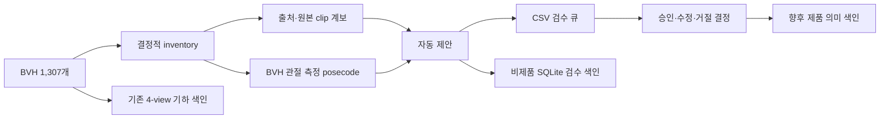

# BVH 라이브러리 색인·태깅 구현 보고서

> 작성일: 2026-08-14, 검수 정책 갱신: 2026-08-17  
> 대상 저장소: Standin-server  
> 대상 라이브러리: `data/bvh`의 활성 BVH 1,307개  
> 상태: 관절 기반 태그 615단위 자동 검증 완료, P0/P1 39단위 검수 대기

## 1. 요약

현재 활성 BVH 1,307개에 대해 다음 작업을 완료했다.

1. BVH 파일과 기존 기하 DB의 전수 일치 여부를 검증했다.
2. 재실행해도 바뀌지 않는 내부 라이브러리 번호를 부여했다.
3. 원본·미러를 묶어 654개의 의미 검수 단위를 만들었다.
4. 각 BVH의 실제 관절 위치에서 결정적으로 계산되는 posecode 태그를 생성했다.
5. 출처 clip, 원본 이름, 제공처 번호, 파일 계보를 별도 장부로 분리했다.
6. 자동 태그 제안과 사람의 승인·수정·거절 결정을 분리했다.
7. CSV 검수 큐와 비제품용 SQLite 검수 색인을 만들었다.
8. 기존 4-view 기하 검색 DB는 변경하지 않고 의미 색인을 병렬 구조로 추가했다.

최종 검증 결과는 `pass`, 오류는 0건이다. 654개 중 615개는 결정적 관절 규칙과 미러 검증을 거친
`auto_verified_observed_tags` 상태다. 행동명이 비어 있는 38단위와 orphan mirror 1단위만
`needs_review`로 남겼다. Dense embedding은 아직 없으므로 이 결과는 바로 제품에 노출하는 의미
검색 인덱스가 아니라 **제품 색인 생성 전의 재현 가능한 태깅·검수 기반**이다.

## 2. 작업 범위

### 2.1 포함 범위

- 활성 BVH 경로: `data/bvh`
- BVH 수: 1,307개
- 기존 기하 검색 DB: `data/poses.db`
- 기하 투영 엔트리: 5,228개, 포즈당 4개 view
- 원본·미러 의미 단위: 654개
- 원본 출처 단위: 363개

### 2.2 제외 범위

- `data/pose-library-v1/bvh`에만 존재하는 추가 58개는 현재 운영 DB와 불일치하므로 이번 색인에서
  제외했다.
- 사람이 승인하지 않은 태그로 제품 검색 결과를 변경하지 않았다.
- 임베딩 모델을 아직 고정하지 않았으므로 dense embedding을 만들지 않았다.
- 라이선스와 고객 BVH 전달 가능 여부가 미확정인 항목을 제품 승격하지 않았다.

현재 라이브러리 버전은 다음 내용 해시로 식별한다.

```text
sha256:e36e8cd43dc180fcf8b90811b101c781c61158ee105fea68a7f2517e9487a7c8
```

## 3. 설계 원칙

### 3.1 파일명 의미와 관찰 사실을 분리한다

파일명이나 출처 설명의 `dance`, `boxing`, `typing` 등은 행동을 찾기 위한 후보 문맥이다. 반면
`왼쪽 무릎이 굽음`, `양손이 몸통에서 멂` 같은 값은 BVH 관절에서 직접 측정할 수 있는 관찰값이다.
두 종류를 같은 확정 태그로 저장하지 않는다.

### 3.2 정적 BVH에서 알 수 없는 의미를 추측하지 않는다

현재 BVH는 모두 1-frame 정적 포즈다. 따라서 다음 값은 관절만 보고 자동 확정하지 않는다.

- 전통·현대 같은 문화적 의미
- 감정과 의도
- 칼·총·마우스 같은 소품
- 달리기·던지기의 동작 phase
- 승리·패배 같은 서사적 관계

예를 들어 `옛 전통 춤`은 현재 라이브러리에서 `dance` 문맥 후보는 찾을 수 있지만 `전통`을
입증할 메타데이터가 없으므로 `library_gap`으로 남긴다.

### 3.3 기존 기하 검색은 유지한다

이번 구현은 `src/features.py`, `src/library.py`, `src/search.py`의 기하 피처 공간을 바꾸지 않는다.
의미 태그는 후보 탐색과 설명을 위한 별도 계층이며, 승인되지 않은 의미 태그가 기존 Top-K를
회귀시키지 않도록 분리했다.

### 3.4 미러는 검색 포즈로 유지하고 검수만 묶는다

좌우가 반전된 포즈는 실제 검색에서는 서로 다른 유효 후보이므로 삭제하거나 한 포즈로 합치지
않는다. 대신 방향 중립 설명은 `semantic_unit_id` 단위로 한 번 검수하고, 좌우 atom이 정확히
치환되는지 별도로 검사한다.

## 4. 구현 구조



### 4.1 Posecode 생성기

구현: `src/posecode.py`

- BVH를 파싱하고 forward kinematics로 3D 관절 위치를 계산한다.
- COCO17 대응 관절을 사용한다.
- 좌우 hip을 기준으로 몸의 local frame을 만든다.
- 팔꿈치·무릎 각도, 손목·발목의 상대 위치, 몸통 기울기, 관절 간 거리 등을 측정한다.
- 임계값 경계 구간에서는 성급히 양자화하지 않고 검수 대상으로 보낸다.
- 같은 입력은 항상 같은 태그와 측정값을 만든다.
- 관찰 근거가 있는 `observed` atom만 자동 생성한다.

대표 atom 예시는 다음과 같다.

```text
left_leg.behind_body
left_knee.bent
left_wrist.far_from_torso
right_wrist.far_from_torso
both_arms.wide
torso.upright
```

### 4.2 출처·태깅 장부와 검수 색인

구현: `src/semantic_catalog.py`

- inventory에서 안정적인 `pose_id`, `library_no`, `semantic_unit_id`를 만든다.
- 제공처 ID, 원본 clip ID, 원본 제목, 파일 hash, 변환 계보를 분리 저장한다.
- 기존 번호는 유지하고 신규 BVH만 다음 번호에 추가한다.
- 동일 입력으로 다시 실행하면 같은 제안을 중복 추가하지 않는다.
- 입력이나 태깅 규칙이 달라지면 이전 제안을 덮어쓰지 않고 새 revision을 추가한다.
- 자동 제안과 사람의 최종 결정을 별도 JSONL에 저장한다.
- 검수용 full-text search DB를 만들지만 제품용으로 표시하지 않는다.

### 4.3 실행·검증 스크립트

| 파일 | 역할 |
|---|---|
| `scripts/init_bvh_tag_inventory.py` | BVH 전수 inventory와 hash 생성 |
| `scripts/build_semantic_tagging.py` | 출처 장부, posecode, 제안, 검수 큐와 검수 DB 생성 |
| `scripts/validate_semantic_tagging.py` | 파일·DB·계보·atom·기하 색인의 교차 검증 |
| `tests/test_semantic_tagging.py` | 출처 파싱, observed-only, 미러 치환, 공통 passage 검증 |

## 5. 생성 결과

### 5.1 수량

| 항목 | 결과 |
|---|---:|
| BVH pose member | 1,307 |
| 의미 검수 단위 | 654 |
| 원본·미러 정상 쌍 | 653 |
| orphan mirror | 1 |
| 출처 clip | 363 |
| posecode 생성 완료 | 1,307 |
| 개별 BVH 관찰 atom | 14,394 |
| 방향 중립 공통 atom | 5,405 |
| 전체 검수 DB atom | 19,799 |
| 자동 태깅 제안 | 654 |
| 제안 이력 | 2,616 revision |
| 사람이 내린 결정 | 0 |
| 검색 문서 | 1,924 |
| dense embedding | 0 |

제안 이력이 2,616행인 이유는 이번 구현 과정에서 스키마와 제안 입력 fingerprint가 변경될 때
기존 결과를 덮어쓰지 않고 revision으로 보존했기 때문이다. 최종 구현을 동일 입력으로 다시 실행한
결과 이력은 2,616행 그대로 유지되어 중복이 발생하지 않았다.

### 5.2 검수 우선순위

| 우선순위 | 수량 | 의미 |
|---|---:|---|
| P0 | 1 | 원본 없는 orphan mirror, 즉시 확인 필요 |
| P1 | 38 | 행동명이 비어 있는 의미 단위 |
| P2 | 615 | 관절 기반 태그 자동 검증 완료, 사람 검수 생략 |

P0 대상은 다음 파일이다.

```text
rokoko_Typing_UsingMouse_mixamo_00882_mirror
```

`data` 전체에서 대응 원본 BVH가 발견되지 않았으므로 임의로 원본을 생성하거나 연결하지 않았다.

### 5.3 미러 검증

- 미러 atom 좌우 치환 직접 통과: 592쌍
- 임계값 차이를 원본 태그 기준으로 자동 정규화: 61쌍
- 미러 태그 사람 검수 필요: 0쌍
- 원본이 없는 미러: 1개

61쌍은 관절값이 판정 경계에 가까워 원본과 미러가 서로 다른 양자화 결과를 냈던 항목이다. 검색용
방향 중립 태그는 원본의 관찰 atom을 기준으로 다시 생성해 바로잡았고, 양쪽의 원 측정값과 개별
atom은 진단 자료로 보존했다.

## 6. 출처 복구 결과

단일 CMU 공식 카탈로그 snapshot과 로컬 원본 파일을 사용했다. 제공처 사이트를 반복 crawl하지
않고 2026-08-14에 저장한 한 번의 snapshot을 입력으로 고정했다.

| 항목 | 결과 |
|---|---:|
| 전체 source clip | 363 |
| CMU source clip | 253 |
| CMU catalog record 일치 | 232 |
| CMU 공식 제목 복구 | 218 |
| 카탈로그 미일치 CMU source ID | 21 |
| 로컬 raw source clip | 25 |
| hash로 확인된 로컬 frame 계보 | 51 |

CMU 공식 제목이 비어 있거나 catalog에서 찾을 수 없는 값은 파일명으로 추측해 채우지 않았다.
카탈로그 일치 여부와 무관하게 제공처가 확인된 모든 CMU 항목은 검수 큐에서 `CMU`로 표시한다.
카탈로그 미일치와 CMU 라이선스 공통 확인은 태깅 P1 사유에서 제외했다. 별도로 행동명이 비어 있는
source clip 35개만 `missing_action_names.csv`에 남겼다.

출처 snapshot:

- 공식 카탈로그: <https://mocap.cs.cmu.edu/search.php>
- snapshot hash:
  `sha256:7a5bd8c60b22df22b77c8ab3a0b5d6bf24d93511a01f971d169cd3c5f236312b`

출처 복구와 별개로 `commercial_use`, `raw_redistribution`, `product_bvh_export`는 각각 검토해야
한다. 출처 이름을 찾았다는 사실만으로 고객에게 BVH를 전달할 수 있다고 판정하지 않는다.

## 7. 검색어 진단 결과

### 7.1 “왼쪽 다리를 뒤로 들고 양팔은 활짝 편 자세”

관찰 atom의 정확 조건을 사용했을 때 다음 3개가 구조적 후보로 검출되었다.

```text
cmu_05_05_00336_mirror
cmu_117_15_00713
cmu_54_13_00388_mirror
```

이는 단어가 파일명에 들어 있어서 찾은 결과가 아니라, BVH의 좌우 다리 위치와 양팔 거리 조건이
일치해서 찾은 결과다. 다만 아직 dense semantic reranking을 적용하지 않았으므로 세 후보의 최종
자연어 순위 품질을 의미하지는 않는다.

### 7.2 “옛 전통 춤을 추는 자세”

- 출처 문맥에서 `dance`인 의미 단위: 36개
- 승인 또는 자동 생성된 `traditional`, `historical` atom: 0개
- 정확 의미 판정: `library_gap`

현재 데이터만으로 `춤` 후보를 좁히는 것은 가능하지만 `옛 전통` 여부는 판정할 수 없다. 향후
검증된 작품·춤 종류 메타데이터나 사람 caption이 추가되어야 한다. 이 결과는 의미 검색의 한계가
아니라 근거 없는 문화적 태깅을 막는 안전 동작이다.

## 8. 생성 산출물

| 경로 | 설명 |
|---|---|
| `data/semantic/inventory.v1.jsonl` | BVH 전수 inventory와 라이브러리 버전 |
| `data/semantic/source_clips.v1.jsonl` | 제공처 원본 clip 장부 |
| `data/semantic/pose_lineage.v1.jsonl` | BVH별 원본·미러·source 계보 |
| `data/semantic/library_numbers.v1.json` | append-only 내부 번호 registry |
| `data/semantic/proposals.v1.jsonl` | 자동 태깅 제안 revision 이력 |
| `data/semantic/decisions.v1.jsonl` | 사람의 승인·수정·거절 결정 |
| `data/semantic/review_queue.csv` | 654개 의미 단위 태그 검수 큐 |
| `data/semantic/missing_action_names.csv` | 행동명이 비어 있는 CMU source clip 35개 목록 |
| `data/semantic/provenance_review_queue.csv` | 1,307개 BVH 출처 검수 큐 |
| `data/semantic/tagging_review.v1.db` | 비제품용 검색·검수 SQLite DB |
| `data/semantic/tagging-summary.v1.json` | 배치 실행 요약 |
| `data/semantic/tagging-validation.v1.json` | 교차 검증 결과 |

검수 큐 654개 모두 `data/thumbs/<pose_id>__front.png` 미리보기에 연결되어 있다.

## 9. 검증 결과

최종 검증에서 다음 항목을 확인했다.

- JSONL과 CSV 전체 파싱
- inventory의 1,307개와 lineage·검수 DB의 1,307개 일치
- 모든 BVH 경로와 hash 참조 유효성
- 각 pose가 정확히 한 의미 제안에 포함되는지 확인
- 측정값의 NaN·무한대 부재
- atom별 관찰 근거와 provenance 존재
- 미승인 태그의 embedding 생성 금지
- 검수 DB의 `production_ready=false` 확인
- 기하 DB의 1,307 pose와 5,228 projection 일치
- 기하 feature version 유지
- SQLite integrity check

결과:

```text
status: pass
errors: []
기존 smoke test: 48/48 통과
신규 semantic tagging test: 6/6 통과
```

기하 DB hash:

```text
sha256:e8453fef6d8efd51bdfd92c0d62ede5d242871ee2906b37760d1d669f5a8b62f
```

## 10. 현재 남은 작업

### 10.1 제품 의미 검색 전 필수

1. P0 1건과 행동명이 비어 있는 P1 38건을 처리한다.
2. 각 제안을 `accept`, `edit`, `reject` 결정으로 기록한다.
3. CMU는 공통 출처 `CMU`로 유지하고, 제품 BVH export 권한은 출시 단계에서 별도로 확인한다.
4. 승인된 문서만 대상으로 한국어·영어 embedding 모델과 버전을 고정한다.
5. 고정 평가 검색어로 lexical, dense, 기하 hybrid의 가중치를 측정한다.
6. 기존 기하 Top-K의 zero-regression을 확인한 뒤 API를 활성화한다.

### 10.2 현재 제품 사용을 막는 명시적 조건

```text
priority_review_items_remaining
licenses_and_product_bvh_export_unresolved
pinned_dense_embedding_not_built
```

따라서 `tagging_review.v1.db`는 운영 검색 API에 직접 연결하면 안 된다.

## 11. BVH 약 150개 추가 시 절차

새 BVH를 `data/bvh`에 넣은 뒤 전체를 다시 처리한다. 전체 재실행을 하더라도 기존
`library_no`는 유지되며 신규 BVH만 다음 번호를 받는다. 변경 없는 자동 제안도 중복되지 않는다.

```bash
.venv/bin/python -B scripts/init_bvh_tag_inventory.py \
  --bvh-dir data/bvh \
  --output data/semantic/inventory.v1.jsonl

.venv/bin/python -B scripts/build_semantic_tagging.py \
  --inventory data/semantic/inventory.v1.jsonl \
  --bvh-dir data/bvh \
  --raw-dir data/_action_raw \
  --output-dir data/semantic \
  --cmu-catalog-html data/semantic/snapshots/cmu-search-20260814.html \
  --cmu-catalog-captured-at 2026-08-14

.venv/bin/python -B scripts/validate_semantic_tagging.py \
  --output-dir data/semantic \
  --geometry-db data/poses.db
```

추가 배치에서는 아래를 함께 확인해야 한다.

- 신규 BVH를 포함해 `data/poses.db`도 다시 빌드했는가?
- 신규 pose에만 새 `library_no`가 붙었는가?
- 새 mirror가 원본과 올바르게 연결되었는가?
- 동일하거나 거의 같은 pose가 Top-K를 채우지 않는가?
- 신규 출처와 라이선스 snapshot이 기록되었는가?
- 변경 없는 1,307개의 검수 결정이 보존되었는가?

## 12. 결론

현재 1,307개 라이브러리는 기하 검색과 별도로 **출처 추적 가능한 posecode 기반 의미 태깅 구조**를
갖췄다. 자연어 문장을 파일마다 여러 개 붙여 일대일 매칭하는 방식이 아니라, 실제 관절에서 계산한
작은 의미 atom을 검색 재료로 사용하도록 구성했다.

다음 단계의 핵심은 태그를 더 많이 자동 생성하는 것이 아니라, 행동명이 비어 있는 38개 의미 단위와
orphan mirror 1개를 처리한 뒤 embedding과 hybrid search를 평가하는 것이다. 이 과정을 거치면 추가될 약 150개도
기존 번호·계보·결정을 훼손하지 않고 같은 방식으로 증분 색인할 수 있다.
