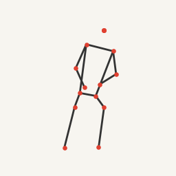

# BVH 색인·태깅 전달 묶음

> 생성일: 2026-08-17  
> 대상: 활성 BVH 1,308개 / 의미 단위 654개
>
> 2026-08-18 갱신: 행동명이 없던 CMU 35개 source clip(38 semantic unit)은 품질 사유로
> 검색 제외·삭제 대기 상태가 되었고, `_00882` orphan mirror의 원본 짝을 생성했다. 이름이 있는
> 나머지 328개 source clip은 semantic vocab v2 canonical source context로 자동 매핑했다.

이 폴더는 2026-08-17 기준 라이브러리 색인·태깅 결과와 남은 검수 항목을 한 번에 전달하기 위한
스냅샷이다. 빌드가 참조하는 원본 산출물은 기존 `data/semantic/`에 유지되어 있다.

## 현재 상태

- 관절 기반 태그 자동 검증: P2 616개
- 검색 제외: PX 38개 의미 단위, CMU source clip 35개
- 과거 행동명 자동 제안 38개: `superseded_by_library_exclusion`, 적용하지 않음
- Orphan mirror: 0개 (`rokoko_Typing_UsingMouse_mixamo_00882` 원본 짝 생성)
- 미러 태그 원본 기준 자동 정규화: 61쌍
- 미러 태그 추가 검수: 0쌍
- semantic vocab v2 source mapping: 328개(행동 ID 242, facet-only 40, unknown 46)
- fallback 검색 coverage: 328/328 source, 616 unit(unknown 행동 46 source/94 unit 포함), 공백 0
- 최종 검색 문서: 616 unit / 1,232 pose member / 2,892 text document / 5,044 observed atom
- pinned E5 staging index: 2,892/2,892 embedding, 384차원, truncation 0, validator pass
- 구조 검증: `pass`, 오류 0건
- 최종 문서 회귀 테스트: 7/7 통과
- semantic index 회귀 테스트: 9/9 통과
- golden queries v2: 45개(dev 30/holdout 15), 측정·문맥 정답 완성, 테스트 10/10 통과

## 파일

| 파일 | 내용 |
|---|---|
| [IMPLEMENTATION_REPORT.md](IMPLEMENTATION_REPORT.md) | 전체 색인·태깅 구현 보고서 |
| [MISSING_ACTION_NAMES.md](MISSING_ACTION_NAMES.md) | 행동명 누락 CMU 35개 번호 목록 |
| [missing_action_names.csv](missing_action_names.csv) | 행동명 입력용 상세 CSV |
| [../../config/semantic_vocab.v2.json](../../config/semantic_vocab.v2.json) | 시맨틱 검색용 표준 행동·자세·단계·스타일·소품 어휘 v2 |
| [../SEMANTIC_ACTION_MAPPING_REPORT_2026-08-18.md](../SEMANTIC_ACTION_MAPPING_REPORT_2026-08-18.md) | 이름 있는 source clip 328개 자동 매핑 결과·미매핑 목록 |
| [../../data/semantic/action_mapping_review.v2.csv](../../data/semantic/action_mapping_review.v2.csv) | 328개 매핑·fallback 채널·선택적 검수 입력 칸이 포함된 CSV |
| [../../data/semantic/action_mapping.v2.jsonl](../../data/semantic/action_mapping.v2.jsonl) | 재현 가능한 v2 source-context 매핑과 검색 coverage 원장 |
| [../SEMANTIC_SEARCH_DOCUMENT_BUILD_2026-08-18.md](../SEMANTIC_SEARCH_DOCUMENT_BUILD_2026-08-18.md) | 최종 검색 문서 세트 빌드 결과·근거 분리·샘플 |
| [../../data/semantic/search_documents.v2.jsonl](../../data/semantic/search_documents.v2.jsonl) | 활성 616 unit의 방향 중립 최종 검색 문서 세트 |
| [../../data/semantic/search-document-summary.v2.json](../../data/semantic/search-document-summary.v2.json) | 문서 수·coverage·입력 fingerprint 요약 |
| [../SEMANTIC_INDEX_BUILD_2026-08-18.md](../SEMANTIC_INDEX_BUILD_2026-08-18.md) | pinned encoder·embedding·staging DB 빌드 및 검증 결과 |
| [../GOLDEN_QUERIES_V2_2026-08-18.md](../GOLDEN_QUERIES_V2_2026-08-18.md) | 현재 staging build 기준 golden v2 구성·분할·판정 경계 |
| [../../config/semantic_embedding.e5-small.v1.json](../../config/semantic_embedding.e5-small.v1.json) | model revision·artifact hash·runtime·pooling·prefix 단일 설정 |
| [../../data/semantic/builds/217d56e31c42634ec920db8704dd151b088b2f12291d5e3726f5b34c9be50196/semantic-build.json](../../data/semantic/builds/217d56e31c42634ec920db8704dd151b088b2f12291d5e3726f5b34c9be50196/semantic-build.json) | member PoseCode schema v2/API blocker 갱신 최종 staging build manifest |
| [excluded_source_clips.csv](excluded_source_clips.csv) | 품질 사유 검색 제외·삭제 대기 CMU 35개 source clip |
| [action_name_review/action_name_review.csv](action_name_review/action_name_review.csv) | 자동 제안·신뢰도·근거·최종 입력 칸이 포함된 38개 검수표 |
| [action_name_review/action_name_proposals.v1.json](action_name_review/action_name_proposals.v1.json) | 자동 제안 원본 JSON(`proposed_not_applied`) |
| [action_name_review/review_sheet_01.png](action_name_review/review_sheet_01.png) | 4방향 썸네일 검수 시트 1/7(같은 폴더에 2–7번 시트) |
| [action_name_review/high/review_sheet_01.png](action_name_review/high/review_sheet_01.png) | 고신뢰 22개 전용 검수 시트 1/5(같은 폴더에 2–5번 시트·CSV) |
| [action_name_review/medium/review_sheet_01.png](action_name_review/medium/review_sheet_01.png) | 중간 신뢰 13개 전용 검수 시트 1/3(같은 폴더에 2–3번 시트·CSV) |
| [action_name_review/low/review_sheet_01.png](action_name_review/low/review_sheet_01.png) | 저신뢰 3개 전용 검수 시트와 CSV |
| [review_queue.csv](review_queue.csv) | 654개 의미 단위 전체 검수 상태 |
| [provenance_review_queue.csv](provenance_review_queue.csv) | BVH 번호·출처·원본 계보 목록 |
| [tagging-summary.v1.json](tagging-summary.v1.json) | 최신 태깅 배치 집계 |
| [tagging-validation.v1.json](tagging-validation.v1.json) | 최종 교차 검증 결과 |
| [assets/rokoko_Typing_UsingMouse_mixamo_00882_mirror__front.png](assets/rokoko_Typing_UsingMouse_mixamo_00882_mirror__front.png) | P0 orphan mirror 정면 썸네일 |
| [assets/rokoko_Typing_UsingMouse_mixamo_00882__front.png](assets/rokoko_Typing_UsingMouse_mixamo_00882__front.png) | 새로 생성한 원본 짝 정면 썸네일 |

행동명 검수표와 시트는 결정 이력 보존용 과거 자료다. 해당 35개 source clip은
`config/library_exclusions.v1.json` 정책에 따라 semantic·geometry·release 대상에서 제외되고 실제
BVH 삭제만 대기한다.

## P0 썸네일

현재는 아래 원본 짝을 생성해 P0가 해소됐다.

CMU 항목은 검수용 CSV의 `source_provider` 또는 `provider` 열에 모두 `CMU`로 표시한다. 관절 기반
태그가 정상인 P2는 `auto_verified_observed_tags` 상태이며 별도 사람 검수 목록에서 제외했다.

## 과거 행동명 검수 방법(사용 중지)

`action_name_review/action_name_review.csv`에서 각 행의 `decision`을 `accept`, `edit`, `reject` 중
하나로 입력한다. `accept`는 제안명을 그대로 채택하고, `edit`는 `action_name_final`에 원하는 이름을
쓰며, `reject`는 행동명을 비워 둔다는 뜻이다. 한 source clip에 서로 다른 순간이 둘 이상 있는
9·19·23번은 의미 단위별로 각각 판단한다.

단일 BVH 프레임만으로 소품, 동작의 전후 단계, 춤·무술의 정확한 기술명까지 확정할 수 없으므로
제안명은 원본 메타데이터에 자동 반영하지 않았다. 우선 저신뢰 1·8·30번과 중간 신뢰 항목을 보고,
고신뢰 항목은 썸네일과 이름이 맞으면 일괄 `accept`해도 된다.
